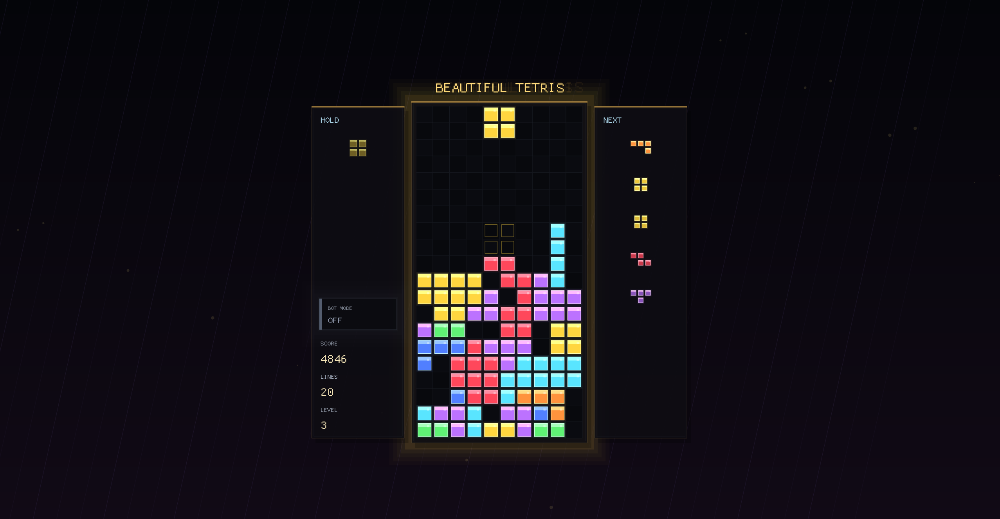

<p align="center">
  
</p>

<h1 align="center">Beautiful Tetris</h1>

<p align="center">
  <a href="https://github.com/noirdaisyq/beautiful-tetris/releases/latest"></a>
  
  
  
</p>

<p align="center">
  Оконный масштабируемый Tetris на Rust с неоновым стилем, ghost piece, hold, звуками, растущей скоростью и двумя режимами AI-автоплея.
</p>

## Скачать

Готовый Windows-билд лежит в [Releases](https://github.com/noirdaisyq/beautiful-tetris/releases/latest).

1. Скачай `beautiful-tetris-v0.1.0-windows-x64.zip`.
2. Распакуй архив.
3. Запусти `beautiful-tetris.exe`.

## Что внутри

- Масштабируемое отдельное окно на `macroquad`.
- Классический Tetris: очередь следующих фигур, hold, ghost piece, очки и уровни.
- `B` включает быстрый AI, который мгновенно ставит фигуры.
- `N` включает natural AI: тот же алгоритм, но без hard drop, чтобы фигура красиво падала сама.
- Неоновый след падающей фигуры и более оформленный интерфейс.
- Синтезированные звуки без внешних аудиофайлов.

## Запуск

Если хочешь собрать из исходников:

```powershell
cargo run --release
```

## Управление

```text
Left / A        move left
Right / D       move right
Down / S        soft drop
Up / W / X      rotate clockwise
Z               rotate counter-clockwise
Space           hard drop
C / Left Shift  hold
P               pause
R               restart
B               toggle fast AI autoplay
N               toggle natural AI autoplay
Esc             quit
```

Скорость растёт через уровень: каждые 10 очищенных линий повышают `LEVEL`, а уровень ускоряет падение.
